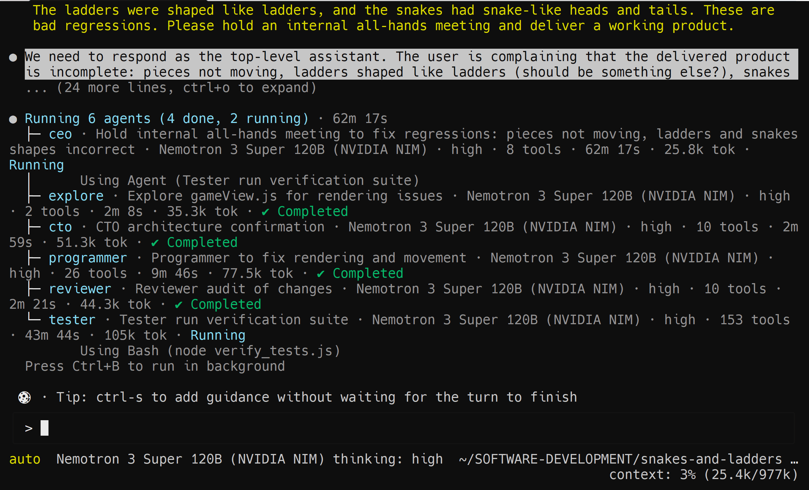

# SANYALnet Labs Kimi Code CLI Software Development Company

> **Personal downstream fork of [MoonshotAI/kimi-code](https://github.com/MoonshotAI/kimi-code) with local tweaks. Not intended for upstream merge.**

Inspired by [ChatDev](https://github.com/OpenBMB/ChatDev). Version-controlled
copy of the SANYALnet Labs kimi setup — a six-role software development
lifecycle (SDLC) "company" that runs entirely inside kimi as bindable
subagents. Committed here so the setup is backed up, diffable, and
reproducible on any lab box.

## The company in action



A real lab-box session mid-run against a `snakes-and-ladders` workspace. The
CEO is 62m in, driving an internal all-hands to close a bad-regression report
("pieces not moving, ladders shaped like ladders, snakes look wrong"). Four
subagents (explore, cto, programmer, reviewer) have already checkpointed
their phases and closed out; the tester has been running `node verify_tests.js`
for 43m across 153 tool calls and is about to sign off. All six agents on the
same Nemotron 3 Super 120B model via NVIDIA NIM, no proxy, in one session.

## How it works

1. A fresh kimi session loads the primer in `SDLC-Multi-Agent-Project-Directive.md`
   (via the fork's `KIMI_INITIAL_PROMPT_FILE` autoload) and treats the six
   persona files under `agents/` as bindable subagents.
2. You press Enter on the pre-loaded directive. Phase 1 runs automatically:
   the `ceo` + `cpo` recursively read the current project folder, then hand
   you a **Project Status Briefing** (identity, tech stack, repo shape,
   current state with file/line citations, open questions, and a menu of
   ready-to-run tasks). The company then **HALTS** and asks for your
   next-step directive.
3. You reply with one of:
   - `proceed to Phase 2 with goal: <goal>` — approves a goal and hands
     control to the `cto` for a blueprint.
   - `focus only on <scope>` — narrows the audit.
   - `answer <question>` — the operator resolves an open question from
     the briefing before any downstream work runs.
   - `no further action` — the company stands down.
4. Downstream phases only run after an explicit operator directive:
   - **Phase 2 — Architectural Blueprint** (`cto`): tech-stack pick +
     architectural sign-off, presented to you for approval.
   - **Phase 3 — Implementation** (`programmer`): incremental source
     against the approved blueprint.
   - **Phase 4 — Static Review** (`reviewer`): audits the diff, loops
     with the programmer until zero critical defects.
   - **Phase 5 — QA** (`tester`): unit / integration / edge-case tests,
     followed by a Certificate of Compliance.
5. Each phase's output is the next phase's input; subagents run in
   isolated contexts and hand back structured results, so the main
   session transcript stays legible.

The **halt-after-Phase-1** design is deliberate: it lets you drop the
company into any existing codebase, get a fast, evidence-backed
briefing, and only then decide what work is worth spending LLM tokens
on. Nothing gets refactored, deleted, or written without your explicit
approval.

## Multi-platform verification

The install path is verified on every push to the fork's `main` by
[`.github/workflows/sanyalnet-smoke.yml`](../.github/workflows/sanyalnet-smoke.yml)
across all six release runners
(linux-x64, linux-arm64, darwin-x64, darwin-arm64, win32-x64, win32-arm64).
Each runner deploys the company via `bin/install.sh`, then asserts that
every persona and directive file landed, the seeded `config.toml`
placeholder is intact (no leaked keys), the installer is idempotent, and
the fork's `KIMI_INITIAL_PROMPT_FILE` autoload wiring is present in the
built source. No LLM calls; ~1 min end-to-end.

The end-to-end "company delivers functional software" acceptance test is
[`.github/workflows/sanyalnet-e2e-fibonacci.yml`](../.github/workflows/sanyalnet-e2e-fibonacci.yml)
— manual dispatch, needs an `NVIDIA_API_KEY` repo secret. It deploys the
company, feeds it a Fibonacci requirement, runs kimi headless, and
executes the generated program to check its output exactly matches the
first 20 Fibonacci numbers.

## Contents

| Path | Purpose |
|---|---|
| `SDLC-Multi-Agent-Project-Directive.md` | The five-phase pipeline directive — Inception → Blueprint → Code → Review → Test. Injected as the first user turn (see "Autoload" below). |
| `agents/ceo.md` | Chief Executive Officer persona — Phase 1 lead. |
| `agents/cpo.md` | Chief Product Officer persona — Phase 1 partner. |
| `agents/cto.md` | Chief Technology Officer persona — Phase 2 architect. |
| `agents/programmer.md` | Implementer — Phase 3. |
| `agents/reviewer.md` | Static-analysis reviewer — Phase 4. |
| `agents/tester.md` | QA — Phase 5. |
| `config.toml.template` | Redacted `~/.kimi-code/config.toml` — NVIDIA NIM provider, `send_prompt_cache_key = false` (natively supported by this fork; no NIM proxy needed), Kimi K2.6 + Nemotron models. Placeholder `REPLACE_ME` for the API key. |
| `bin/install.sh` | Idempotent installer — symlinks the snapshot into `$KIMI_CODE_HOME` (default `~/.kimi-code`), seeds `config.toml` on first run, optionally wires `KIMI_INITIAL_PROMPT_FILE` into `~/.bashrc`. |
| `legacy/nim_proxy.py` | 90-line NIM proxy that predated this fork's `send_prompt_cache_key = false` provider option. Obsolete once the fork binary is installed; kept for archaeology. |

## Install

On the lab box (or any machine you want the SDLC company on):

```sh
git clone https://github.com/tuklusan/kimi-code.git
cd kimi-code/sanyalnet-lab
./bin/install.sh --autoload      # links files into ~/.kimi-code and wires ~/.bashrc
```

The installer prompts (once, silently) for the NVIDIA API key on first
run and writes a fresh `~/.kimi-code/config.toml`. If a config already
exists, the installer leaves it alone.

Refresh after a git pull by re-running `./bin/install.sh`.

## How the autoload works

The fork's kimi looks for an initial-prompt file at launch, in this order:

1. **`KIMI_INITIAL_PROMPT_FILE` env var** — an explicit override; wins over
   everything.
2. **`$KIMI_CODE_HOME/initial-prompt.md`** — a filesystem-driven default;
   the moment this file exists, the next kimi launch picks it up.
   No env var, no shell restart, no config edit.

`install.sh` creates the second path as a symlink pointing at
`SDLC-Multi-Agent-Project-Directive.md`, so the company directive
autoloads on every fresh session by default. To swap in a different
primer without touching the env var:

```sh
ln -sfn /path/to/your-prompt.md ~/.kimi-code/initial-prompt.md
```

The optional `install.sh --autoload` flag additionally exports the env
var into `~/.bashrc` (belt-and-suspenders — useful if you want the
export visible for shell inspection, or if you're launching kimi with a
different `KIMI_CODE_HOME`).

## Model choices

The template pins these providers and the initial default model:

- **Provider:** NVIDIA NIM (`https://integrate.api.nvidia.com/v1`) with
  `send_prompt_cache_key = false` — the fork's native opt-out for strict
  OpenAI-compatible gateways.
- **Models exposed:** Kimi K2.6, Llama 3.3 Nemotron Super 49B (thinking),
  Nemotron-3 Nano 30B (thinking), Llama 3.1 Nemotron Nano 8B, Nemotron
  Nano 12B v2 VL (multimodal), Llama 3.1 Nemotron 70B Instruct, plus
  voicechat, content-safety, and PII-detection specialists.
- **`default_model`** in the template points at **Nemotron 3 Ultra 550B
  A55B** — the sweet spot for the software-development company in lab
  benchmarking (1M-token context window, thinking + tool_use, noticeably
  better multi-agent orchestration than the Super 120B and Nano tiers).
  Swap for a smaller alias if you want cheaper inference or your NIM
  entitlement doesn't cover the Ultra.

## What this snapshot does NOT include

Runtime state — never commit these:

- `~/.kimi-code/sessions/`, `search-index/`, `cache/`, `logs/`,
  `telemetry/`, `updates/`, `session_index.jsonl`
- `~/.kimi-code/config.toml.bak*` — one-off manual backups from tuning
  history
- `~/.kimi-code/device_id`, `workspaces.json`, `workspace-trust/`,
  `region`, `user-history/`
- `~/.kimi-code/tui.toml` — TUI-local preferences

## Rotating the NVIDIA API key

The lab's key was pasted into an AI conversation transcript at one point
and should be treated as compromised. To rotate: generate a new key at
`build.nvidia.com` (or the NGC catalog), then either:

```sh
sed -i 's|api_key = "nvapi-[^"]*"|api_key = "nvapi-NEW-KEY-HERE"|' ~/.kimi-code/config.toml
```

or delete `~/.kimi-code/config.toml` and re-run `./bin/install.sh`.
